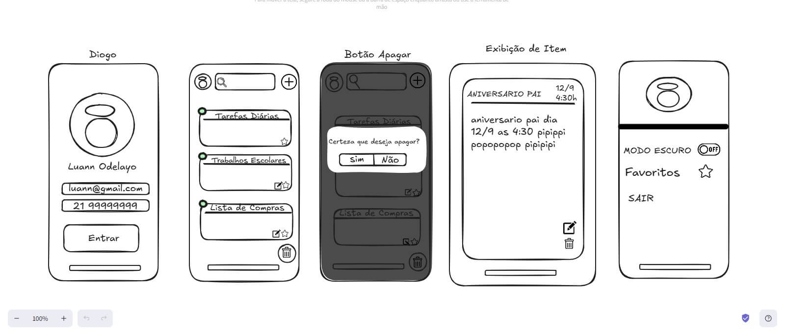
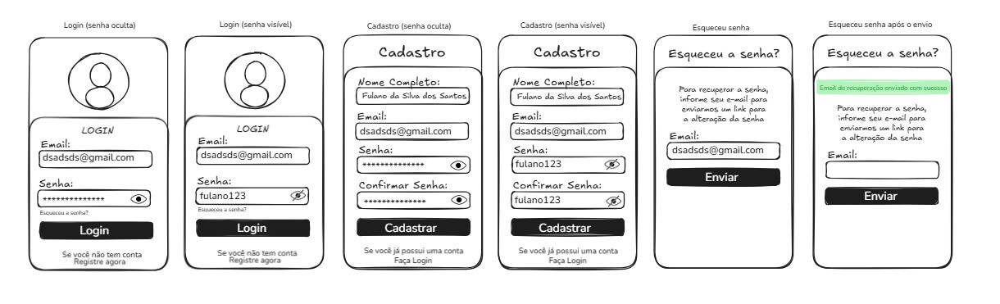

# Aplicativo de Anotações

Um aplicativo simples e intuitivo para criar e gerenciar listas de itens.

---

## 🎯 **Objetivo**
Desenvolver um aplicativo de lista de itens para diferentes finalidades, como tarefas, compras ou planejamento diário.

---

## 🧑‍💻 **Público-Alvo**
Usuários a partir de 16 anos.

---

## 🌐 **Plataformas**
O aplicativo estará disponível para as seguintes plataformas:
- **Web App**  
- **Android**  
- **iOS**  
- **PC (Windows)**  

---

## 📋 **Funcionalidades**
- Criação de listas de tarefas, compras e atividades diárias.
- Personalização de cores para cada item.
- Configuração de datas de expiração para os itens.
- Modo **claro** e **escuro** para melhor experiência do usuário.

---

## 📌 **Requisitos**
1. Cada item deve ter uma **data de expiração** configurável.  
2. O sistema deve estar disponível **na nuvem** para sincronização.  
3. Suporte a **tema claro** e **modo escuro**.  
4. Permitir **seleção de cores** diferentes para cada item.

---

## 🚀 **Como Usar**
1. **Criar uma lista**: Adicione itens e organize suas tarefas ou compras.  
2. **Configurar expiração**: Defina uma data de validade para cada item, se necessário.  
3. **Personalizar**: Escolha cores e temas que melhor atendam às suas preferências.  
4. **Acessar de qualquer lugar**: Use o aplicativo na plataforma de sua preferência e tenha suas listas sempre disponíveis.

---

## 📱 **Capturas de Tela**

**Fluxo de Cadastro e Registro**

---

## 🛠️ **Tecnologias Utilizadas**
*(Liste aqui as tecnologias, linguagens e frameworks utilizados no desenvolvimento do projeto.)*

1. HTML
2. CSS
3. JS

---

## 📌 **Contribuição**
Sinta-se à vontade para contribuir com melhorias, correções ou novas funcionalidades.  
1. Faça um fork do repositório.  
2. Crie uma branch com sua feature: `git checkout -b minha-feature`.  
3. Envie um pull request.

---

## 🧩 Modelo de Banco de Dados
Visualize o modelo de banco de dados em [nosso repositório](/docs/mermaid/planoDeBancoDeDados.md)

---

## 📝 **Licença**
Este projeto está licenciado sob a [Licença MIT](LICENSE).

---

## 📧 **Contato**
Caso tenha dúvidas ou sugestões, entre em contato:  
**Nome:** João Nascimento  
**Email:** [seuemail@exemplo.com](mailto:seuemail@exemplo.com)